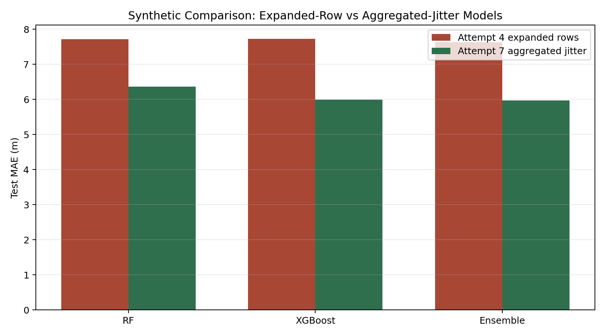
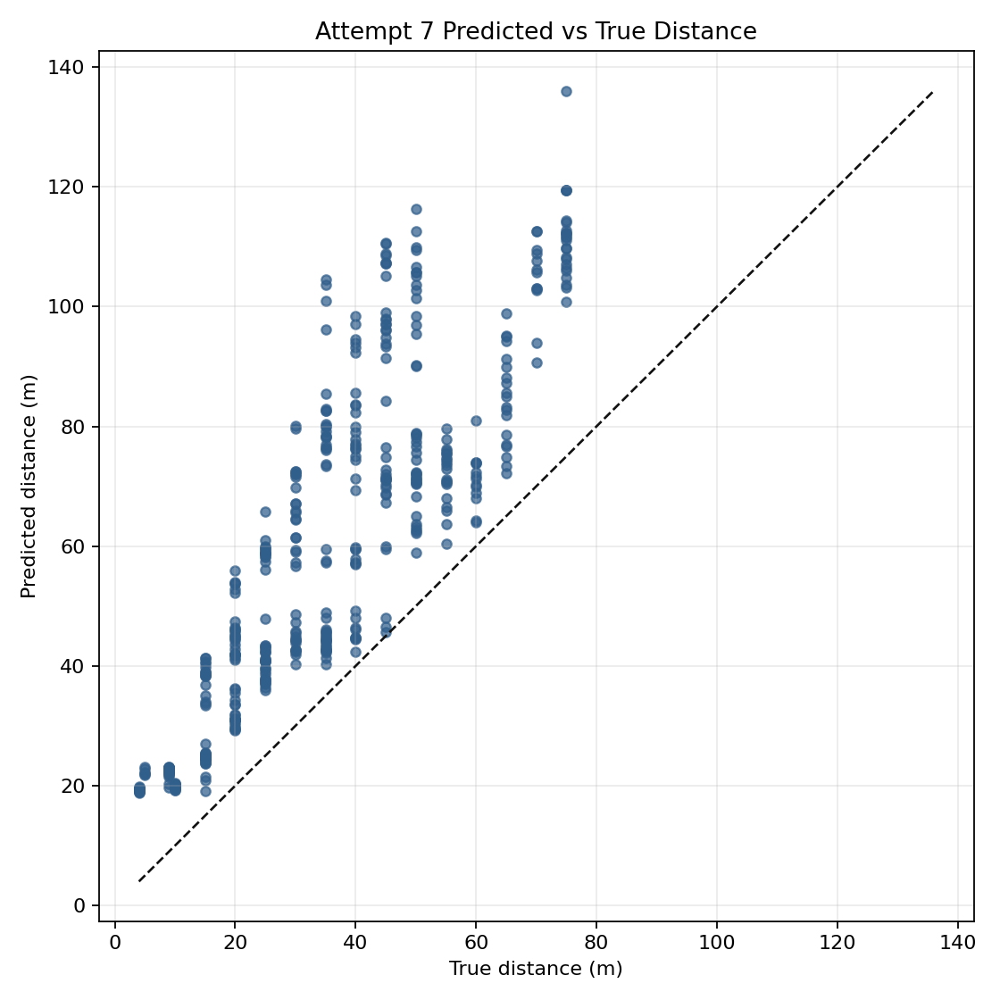
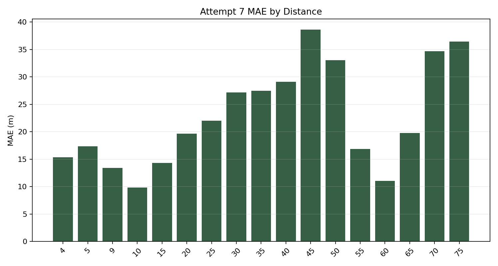
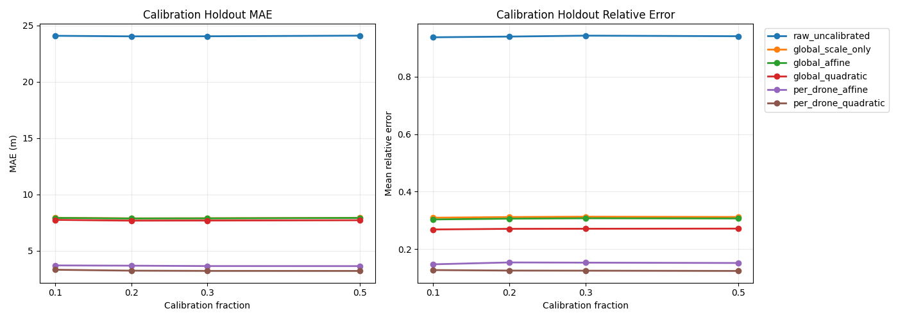
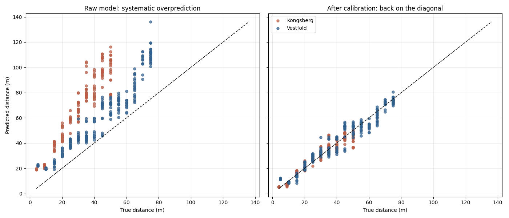
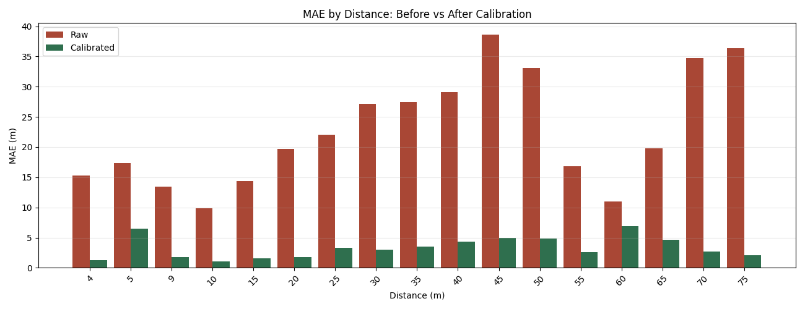

# Attempt 7: Aggregated-Jitter Ensemble Revisited

This document is the full recap of `attempt7`.

It explains:

- why this attempt was created after `attempt4`, `attempt5`, and `attempt6`
- what exact question we wanted to answer about the `5.21` jitter-summary model
- how we made the comparison fair
- what each study tested
- how the synthetic and real-data results changed
- what calibration did for the new ensemble
- what we learned about the right way to use jitter

In short, `attempt7` asked a very specific follow-up question:

- instead of using the `attempt4` detector-like expanded-row jitter representation,
- what happens if we build an RF+XGBoost ensemble on the **aggregated jitter-summary representation**
- that originally gave the strong `~5.21m` result in `attempt3/study03`
- and evaluate it under the same source-image split assumptions used by the previous ensemble work?

The main result is:

- synthetic tuned blend on aggregated-jitter features: `5.9725m` test MAE
- previous `attempt4` tuned blend on expanded rows: `7.6347m` test MAE
- raw Nenrus external MAE for the new ensemble: `23.9967m`
- raw Nenrus external MAE for the old ensemble: `26.1078m`
- calibrated Nenrus full-fit MAE for the new ensemble: `3.1812m`
- calibrated Nenrus honest `20%` split MAE: `3.2264m`

So the overall conclusion of `attempt7` is:

- the **aggregated jitter-summary representation** is stronger than the old expanded-row representation
- this helps both synthetic evaluation and real Nenrus transfer
- calibration is still needed on Nenrus
- after calibration, the new model becomes highly usable on the real data

## 1. Why Attempt 7 Exists

By the end of `attempt6`, we had two different jitter stories:

- `attempt3/study03` showed a very strong random-forest result around `5.21m`
- `attempt4` later built the official RF+XGBoost ensemble, but on a different jitter representation

That created an important methodological question:

- did the ensemble use the same kind of jitter that produced the earlier `5.21m` result?

The answer was:

- **no**

There were two different jitter formulations in the project:

### Aggregated jitter-summary representation

This is the `attempt3/study03` idea:

- start from one source image and one bbox
- create several jittered bbox variants
- compute depth and geometry features for each jitter
- aggregate those jitter values back into one robust row per image

This is the representation that produced:

- `raw_depth_geometry_metadata_rf`
- test MAE `5.2105m`

### Expanded-row detector-like representation

This is the `attempt4` idea:

- start from one source image and one bbox
- create several jittered bbox variants
- keep each jitter as its own row
- train RF and XGBoost directly on those expanded rows

This is the representation that produced the official earlier ensemble:

- RF baseline: `7.7124m`
- XGBoost baseline: `7.7301m`
- tuned blend: `7.6347m`

So `attempt7` exists to answer:

- if we build an ensemble using the **same aggregated jitter-summary family** that produced the strong `5.21m` RF,
- do we get a better ensemble than the old expanded-row RF+XGBoost blend?

## 2. High-Level Structure

`attempt7` contains four studies:

- [Study 01](studies/study01): train RF, XGBoost, and a blend on the aggregated-jitter feature table under a split mapped from `attempt4`
- [Study 02](studies/study02): export the fitted aggregated-jitter ensemble artifacts
- [Study 03](studies/study03): evaluate the frozen new ensemble on the prepared Nenrus real-drone dataset
- [Study 04](studies/study04): apply the same Nenrus calibration procedure used in `attempt5`, but on the new Attempt 7 predictions

The progression is:

- first make the synthetic comparison as fair as possible
- then export the new model family
- then test its raw real-data transfer
- then test whether the same style of calibration still works

## 3. The Key Fairness Rule

The most important design choice in `attempt7` is that we did **not** compare the old `5.21m` number directly to the `attempt4` ensemble and treat that as apples-to-apples.

We found an important detail:

- the old `attempt3/study03` evaluation did not effectively use the exact same full evaluated set as the later `attempt4` family
- in particular, the historical split artifacts excluded the full `150m` block from the effective evaluation rows

So for `attempt7` we built a fairer comparison:

- keep the full aggregated-jitter feature table from `attempt3/study03`
- map the **Attempt 4 source-image split** onto that one-row-per-image representation
- train RF and XGBoost on that mapped split
- blend them on the same mapped dev/test partition

This means the new synthetic result is not just:

- "better because it uses a different feature idea"

It is also:

- "measured under a cleaner comparison against the old ensemble family"

## 4. What Representation Attempt 7 Uses

The new ensemble is built on the exact `attempt3/study03` winning feature family:

- one raw depth feature
- jitter-aggregated geometry medians
- jitter-aggregated geometry standard deviations
- metadata one-hot features

The selected feature set contains `21` features:

### Raw depth

- `bbox_only__inner50_median__object_depth__jitter_median`

### Geometry medians

- `bbox_width_px__jitter_median`
- `bbox_height_px__jitter_median`
- `bbox_width_norm__jitter_median`
- `bbox_height_norm__jitter_median`
- `bbox_area_ratio__jitter_median`
- `bbox_aspect_ratio__jitter_median`
- `bbox_center_x_norm__jitter_median`
- `bbox_center_y_norm__jitter_median`

### Geometry spread

- `bbox_width_px__jitter_std`
- `bbox_height_px__jitter_std`
- `bbox_width_norm__jitter_std`
- `bbox_height_norm__jitter_std`
- `bbox_area_ratio__jitter_std`
- `bbox_aspect_ratio__jitter_std`
- `bbox_center_x_norm__jitter_std`
- `bbox_center_y_norm__jitter_std`

### Metadata

- `weather=clear_sky`
- `weather=light_rain`
- `time_of_day=10AM`
- `time_of_day=8PM`

The jitter family behind these features is:

- `original`
- `shift_left`
- `shift_right`
- `shift_up`
- `shift_down`
- `scale_down`
- `scale_up`

So unlike `attempt4`, the model does **not** keep several jitter rows per image.
It keeps one robust summary row per source image.

## 5. Study 01: Aggregated-Jitter RF, XGBoost, and Blend

Main files:

- [run_study_01.py](studies/study01/run_study_01.py)
- [config.yaml](studies/study01/config.yaml)
- [summary.json](studies/study01/artifacts/reports/summary.json)
- [analysis.md](studies/study01/artifacts/reports/analysis.md)

### Goal

Study 01 asks:

- if we keep the strong aggregated-jitter feature representation,
- and train both RF and XGBoost on it,
- does the resulting blend beat the old expanded-row ensemble?

### Data Basis

The aggregated feature table covers:

- total rows: `15,064`
- dev rows after mapping Attempt 4 split: `12,804`
- test rows after mapping Attempt 4 split: `2,260`

This is one row per source image.

### Model Candidates

RF candidates:

- `rf_shallow`
- `rf_medium`
- `rf_deep`
- `rf_unbounded`

XGBoost candidates:

- `xgb_shallow`
- `xgb_medium`
- `xgb_deep`
- `xgb_regularized`

### Selected Winners

- RF winner: `rf_deep`
- XGBoost winner: `xgb_deep`

### Main Synthetic Results

Attempt 7 aggregated-jitter family:

- RF baseline: `6.3614m`
- XGBoost baseline: `5.9868m`
- equal-weight blend: `6.0395m`
- tuned blend: `5.9725m`

The tuned blend weights were:

- RF: `0.18`
- XGBoost: `0.82`

So in this representation:

- XGBoost is already stronger than RF
- the blend improves a little further
- the synthetic winner is still the tuned RF/XGBoost blend

### Comparison To Attempt 4

Old expanded-row family:

- RF baseline: `7.7124m`
- XGBoost baseline: `7.7301m`
- tuned blend: `7.6347m`

New aggregated-jitter family:

- RF baseline: `6.3614m`
- XGBoost baseline: `5.9868m`
- tuned blend: `5.9725m`

Improvement vs old tuned blend:

- `7.6347m -> 5.9725m`
- gain: `1.6622m`

This is the core conclusion of Attempt 7:

- the jitter-summary representation is better than the jitter-expanded-row representation for this problem

### Synthetic Comparison Graph



## 6. Study 02: Export the New Ensemble

Main files:

- [export_ensemble_models.py](studies/study02/export_ensemble_models.py)
- [config.yaml](studies/study02/config.yaml)
- [summary.json](studies/study02/artifacts/reports/summary.json)

Study 02 saves the Attempt 7 full-dataset ensemble artifacts so they can be used exactly the same way the old Attempt 5 exported ensemble was used.

Saved artifacts:

- `studies/study02/artifacts/models/full_dataset/rf_model.joblib`
- `studies/study02/artifacts/models/full_dataset/xgb_model.joblib`
- `studies/study02/artifacts/models/full_dataset/ensemble.joblib`

The exported model uses:

- `21` features
- no categorical-level lookup at inference time
- the tuned blend `0.18 * RF + 0.82 * XGBoost`

This export step is intentionally parallel to the earlier `attempt5/study01` export workflow.

## 7. Study 03: Real Nenrus Evaluation

Main files:

- [evaluate_nenrus_external.py](studies/study03/evaluate_nenrus_external.py)
- [config.yaml](studies/study03/config.yaml)
- [summary.json](studies/study03/artifacts/reports/summary.json)
- [analysis.md](studies/study03/artifacts/reports/analysis.md)

### Goal

Study 03 asks:

- if we take the new aggregated-jitter ensemble exactly as trained,
- export it,
- and run it on Nenrus just like we ran the old ensemble,
- does it transfer better?

### Raw External Result

Attempt 7 raw Nenrus result:

- count: `489`
- MAE: `23.9967m`
- median absolute error: `19.3488m`
- mean relative error: `0.9407`
- RMSE: `28.2906m`
- R2: `-1.1074`
- overprediction rate: `100%`
- within `5m`: `2.25%`
- within `10m`: `15.95%`

So the model still fails raw on Nenrus in the same general way:

- systematic overprediction
- strong domain shift

But it is still better than the old raw ensemble:

- old Attempt 5 raw MAE: `26.1078m`
- new Attempt 7 raw MAE: `23.9967m`
- improvement: `2.1110m`

### By Drone Type

Old raw ensemble:

- `Kongsberg`: `36.1536m`
- `Vestfold`: `18.9774m`

New raw ensemble:

- `Kongsberg`: `34.0035m`
- `Vestfold`: `16.8940m`

So the improvement appears on both drone subsets, not only one.

### Interpretation

The new synthetic representation does help real transfer, but it does **not** solve the external-domain problem by itself.

The raw prediction bias is still extreme:

- mean signed error: `23.9967m`
- overprediction rate: `1.0`

That means the new ensemble is:

- better than the old raw ensemble
- still not acceptable as a final raw real-world predictor

### Real Raw Graphs





## 8. Study 04: Calibration on the New Ensemble

Main files:

- [config.yaml](studies/study04/config.yaml)
- [summary.json](studies/study04/artifacts/reports/summary.json)
- [analysis.md](studies/study04/artifacts/reports/analysis.md)
- [split_eval_summary.csv](studies/study04/artifacts/reports/split_eval_summary.csv)
- [final_calibrated_metrics.json](studies/study04/artifacts/reports/final_calibrated_metrics.json)

Study 04 intentionally reuses the **same calibration script and protocol** used in `attempt5/study04`.

So the calibration comparison is methodologically aligned:

- same calibration models
- same repeated split evaluation
- same selected function family
- same calibration fractions
- same grouping by `drone_type` and `true_distance_m`

### Selected Calibration Function

The strongest model again is:

- `per_drone_quadratic`

The fitted full-data functions are:

Kongsberg:

```text
corrected = -7.49637448 + 0.69386725 * prediction - 0.00168007 * prediction^2
```

Vestfold:

```text
corrected = -13.57020800 + 1.20957612 * prediction - 0.00380551 * prediction^2
```

### Honest Split Evaluation

At `20%` calibration data:

- `per_drone_quadratic`: MAE `3.2264m`, relative error `0.1252`, within10 `0.9639`
- `per_drone_affine`: MAE `3.6705m`, relative error `0.1535`, within10 `0.9310`
- `global_quadratic`: MAE `7.6709m`, relative error `0.2705`, within10 `0.6495`
- `global_affine`: MAE `7.8623m`, relative error `0.3060`, within10 `0.6835`
- `global_scale_only`: MAE `7.8753m`, relative error `0.3116`, within10 `0.6835`

This means:

- a small labelled calibration subset is enough
- the per-drone quadratic correction remains the best simple option

### Final Full-Data Calibration Fit

Full-data fitted result:

- MAE: `3.1812m`
- median absolute error: `2.3149m`
- mean relative error: `0.1240`
- RMSE: `4.2170m`
- R2: `0.9532`
- within `2m`: `46.42%`
- within `5m`: `79.75%`
- within `10m`: `96.52%`
- within `20m`: `100%`

Before calibration:

- MAE: `23.9967m`
- mean relative error: `0.9407`
- overprediction rate: `100%`

After calibration:

- MAE: `3.1812m`
- mean relative error: `0.1240`
- overprediction rate: `48.88%`

So calibration almost completely removes the systematic external bias.

### Comparison To Previous Calibration

Old calibrated Attempt 5 full-fit result:

- `3.0251m`

New calibrated Attempt 7 full-fit result:

- `3.1812m`

Old honest `20%` split result:

- `3.0735m`

New honest `20%` split result:

- `3.2264m`

So after calibration:

- the new ensemble is **very close** to the old calibrated result
- but it is slightly worse, not better

That means the main gain of Attempt 7 is:

- clearly better raw synthetic performance
- clearly better raw real transfer

but not:

- a better final calibrated Nenrus score than the best previous calibrated pipeline

### Calibration Graphs







## 9. What We Learned

Attempt 7 teaches several important lessons.

### 1. The way jitter is represented matters

The old question was:

- should jitter become several noisy rows,
- or should it become one robust summary row?

Attempt 7 strongly supports:

- one robust summary row

for this project’s distance-regression setting.

### 2. The `5.21m` story was real, but needed a fair rerun

The historical `5.2105m` RF was not the correct direct number to compare against the old ensemble.

Attempt 7 fixed that by:

- using the same aggregated-jitter family
- remapping the later source-image split
- rerunning RF, XGBoost, and the blend cleanly

That produced the more defensible result:

- tuned aggregated-jitter blend: `5.9725m`

### 3. Better synthetic structure helps real transfer

The new raw Nenrus result is still poor, but it is clearly better:

- `26.1078m -> 23.9967m`

So the stronger synthetic representation was not just a synthetic artifact.

### 4. Real deployment still needs calibration

Even the improved raw model still overpredicts all Nenrus samples before calibration.

That means the real blocker remains:

- domain shift

not:

- learner capacity alone

### 5. Calibration stays the practical real-world solution

Per-drone quadratic calibration still turns a bad raw external model into a strong practical Nenrus predictor.

## 10. Best Results From Attempt 7

Synthetic best result:

- `tuned_weight_blend`
- test MAE `5.9725m`

Raw Nenrus external result:

- MAE `23.9967m`

Best honest calibrated Nenrus result:

- `per_drone_quadratic`
- `20%` calibration split MAE `3.2264m`

Best full-data fitted calibrated Nenrus result:

- `per_drone_quadratic`
- MAE `3.1812m`

## 11. Final Conclusion

Attempt 7 successfully answered the original question.

If we build the ensemble on the **same aggregated jitter-summary representation** that produced the strong earlier RF result, then:

- the synthetic ensemble becomes clearly better than the old expanded-row ensemble
- the raw real-data transfer also improves

However:

- raw Nenrus performance is still not good enough by itself
- calibration is still required
- after calibration, the new model is excellent, but only slightly behind the best previous calibrated result

So the final practical interpretation is:

- **aggregated jitter-summary is the better modeling choice**
- **calibration remains the key real-world adaptation step**
