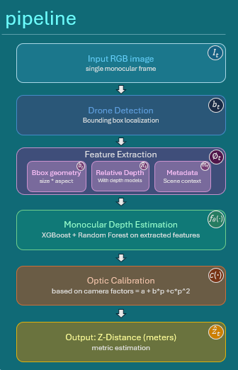

## VI. Proposed Method

This section presents the proposed **AirDepth** framework for estimating the metric distance of a target drone from a single monocular RGB image. The method is designed as a hybrid pipeline that combines drone detection, feature extraction, monocular depth estimation, learned distance regression, and camera-based localization. Rather than treating monocular depth as metric depth directly, the framework learns how visual depth cues, apparent drone scale, and contextual information relate to the true distance from the observing camera.

### A. Framework Overview

The **AirDepth** framework consists of four main stages: **drone detection, visual feature extraction, monocular depth estimation, and 3D localization**. Given an RGB image, the system first identifies the drone region and then estimates its relative distance from the observing camera. The detected drone region is used to extract both geometric cues and depth-based cues, which are fused by a supervised regression model to predict metric distance. Finally, when camera intrinsics are available, the estimated distance is converted into a camera-relative 3D location.

At a high level, the order of the pipeline is as follows:

1. an input RGB image is received,
2. the target drone is localized in the image,
3. a feature representation is built from the detected region,
4. monocular depth cues are estimated and fused with geometric features,
5. the drone distance is predicted in meters,
6. the predicted depth is optionally back-projected into 3D camera coordinates.

Each module contributes a different part of the final estimate. The detection stage tells the system where the drone is located. The feature-extraction stage provides scale, position, and contextual descriptors derived from the drone region. The monocular depth stage supplies relative scene-depth information, which is useful but not yet metric. The final localization stage converts the estimated metric depth into a spatial position relative to the camera. In this way, the full framework moves from raw image appearance to a physically interpretable output.

The motivation for this staged design comes directly from the structure of the problem. A single monocular image does not provide direct metric scale. A drone that is close to the camera but physically small may produce a similar appearance to a larger drone that is farther away. Likewise, monocular depth models are strong at recovering relative scene structure, but their output is not guaranteed to be expressed in meters. AirDepth addresses this limitation by combining complementary sources of information instead of depending on only one cue. The bounding box contributes strong perspective and apparent-size information, the depth model contributes scene-relative distance structure, and the regression stage learns how these cues should be combined under controlled supervision.

The framework is also designed to separate visual perception from metric conversion. The early stages answer the question, "what can be measured from the image region containing the drone?" The later stages answer the question, "how should these measurements be translated into metric distance?" This separation is useful because it makes the method interpretable and modular. A different detector, a different depth network, or a different calibration function can be inserted into the same general pipeline without changing the overall formulation.

Formally, given an image $I_t$, the full AirDepth pipeline can be written as

$$
\hat{z}_t = c\left(f_\theta(\phi(I_t,b_t,R_t,m_t))\right),
$$

where $b_t$ is the detected bounding box, $R_t$ is the relative depth map, $\phi(\cdot)$ is the feature-extraction function, $f_\theta(\cdot)$ is the learned distance regressor, and $c(\cdot)$ is a calibration function used to correct the raw prediction when transferring to the target domain.

In this formulation, the function $\phi(\cdot)$ is especially important. It is the point where raw image evidence is converted into structured measurements that can be modeled reliably. In the proposed framework, $\phi(\cdot)$ includes geometry extracted from the box, relative-depth summaries extracted from the drone region and nearby context, and optional metadata. The output of the regressor is therefore not a direct by-product of the depth map alone, but a learned function of several complementary descriptors.

### B. Drone Detection Module

The detection module receives an input image $I_t$ and produces a bounding box

$$
b_t = (u_t, v_t, w_t, h_t),
$$

where $(u_t, v_t)$ denotes the box center and $(w_t, h_t)$ denote its width and height. In the project pipeline, this stage is implemented in a YOLO-style format: during dataset preparation and controlled experiments the drone region is available through YOLO annotations, while the runtime formulation assumes that a detector provides the same bounding-box representation.

The role of detection in AirDepth is not limited to locating the drone. The bounding box directly influences the downstream distance-estimation stage in two ways. First, it defines the spatial region from which depth information is extracted. Second, it provides important geometric cues related to apparent drone scale. Since a farther drone usually occupies fewer pixels in the image, the bounding-box size itself carries strong distance information.

More specifically, once the detector provides $b_t$, the framework can derive the exact image support on which the remaining stages operate. The center coordinates $(u_t,v_t)$ define the image location later used for back-projection, while the width and height define the scale of the observed drone in the image plane. Because distance and apparent size are strongly coupled by perspective projection, these quantities become informative predictors even before depth is considered. For this reason, the detector output is not treated as a temporary intermediate result; it is one of the main inputs to the distance model itself.

From the predicted or annotated box, the framework derives geometric features such as:

- bounding-box width and height in pixels,
- normalized width and height,
- bounding-box area ratio,
- aspect ratio,
- normalized horizontal and vertical position.

If the image width and height are denoted by $W$ and $H$, then these geometric quantities can be written as

$$
\frac{w_t}{W}, \qquad \frac{h_t}{H}, \qquad \frac{w_t h_t}{WH}, \qquad \frac{w_t}{h_t}, \qquad \frac{u_t}{W}, \qquad \frac{v_t}{H}.
$$

These normalized forms are useful because they reduce dependence on raw image resolution and make the representation more consistent across images.

These cues are later fused with monocular depth features. Because the depth model is asked to estimate the drone distance rather than the entire scene geometry, the accuracy of the detected box has a strong effect on the final prediction. For this reason, the later stages of the method were designed to be robust to small box shifts and scale errors rather than assuming a perfectly stable detector.

This robustness issue is important. In real operation, even a good detector does not produce exactly the same box on every image. Small shifts, slight over-expansion, or slight under-expansion can change both the measured geometry and the depth values extracted from the box. The AirDepth framework therefore treats the detector output as informative but uncertain. Later feature extraction stages explicitly account for this by aggregating measurements under small box perturbations rather than trusting a single exact box blindly.

### C. Depth Estimation Module

The depth estimation module predicts the relative depth $\hat{z}_t$ of the target drone from monocular visual cues. Since direct depth measurements are unavailable, the module learns the relationship between image appearance, object scale, and target distance.

The depth component of AirDepth is learning-based and hybrid in usage. A pretrained monocular depth model is first applied to the RGB image to produce a dense relative-depth map

$$
R_t = D(I_t),
$$

where $R_t \in \mathbb{R}^{H \times W}$ contains relative rather than metric depth values. These values preserve scene structure, but they do not directly correspond to meters. Therefore, AirDepth does not use the raw depth map as the final answer. Instead, it extracts informative depth descriptors from the drone region and combines them with geometric features inside a supervised regression framework.

This distinction between **relative depth** and **metric depth** is central to the method. The depth network can estimate which parts of the scene appear closer or farther, and it can often recover coherent local depth structure around the drone, but it does not know the true physical distance scale of the scene from a single image alone. As a result, two different images may produce depth values that are internally consistent within each image but not directly comparable in absolute units. AirDepth handles this limitation by using the depth map as a source of features rather than as a final measurement.

Conceptually, the depth stage in AirDepth has three sub-roles:

1. generate a relative-depth representation of the scene,
2. isolate the portion of that representation associated with the drone,
3. summarize it into scalar cues that can be fused with geometry.

This is why the framework uses explicit region-based depth summaries instead of feeding the entire depth map directly into the final metric regressor.

To build the final visual representation, AirDepth extracts two complementary feature groups:

1. **Depth-derived features**, computed from the drone region and its immediate surroundings.
2. **Bounding-box geometry features**, computed from the drone size and position in the image.

In addition to these two visual groups, the framework also uses **scene metadata** when such information is available. In the synthetic training dataset, the metadata include weather condition and time of day. These variables do not directly measure depth, but they help the model account for systematic changes in scene appearance that may affect the monocular depth response. Therefore, the effective regression input is a fusion of depth cues, geometric cues, and metadata rather than depth cues alone.

The depth-derived part is motivated by the observation that the drone is a small object and therefore occupies only a limited number of pixels. For such targets, the raw depth values inside the exact bounding box can be unstable because the box may contain a mixture of drone pixels, sky, buildings, or background clutter. The framework therefore evaluates not only the drone box itself but also local context windows around it, allowing the model to compare the drone region against its immediate surroundings.

During the project, several strategies were explored for extracting the drone depth signal, including:

- depth at the box midpoint,
- mean depth inside the full box,
- median depth inside a central region of the box,
- local context around the box at different crop scales,
- normalized depth and object-versus-background depth contrast.

These alternatives correspond to different assumptions about where the useful distance signal lies. Midpoint depth assumes that the center of the detected drone is the cleanest representative pixel. Full-box mean assumes that averaging across the box stabilizes the estimate. Central-region median assumes that the middle of the box is more reliable than the edges, which may include background pixels. Object-versus-background contrast assumes that the relative difference between the drone and its local surroundings may be more stable than the raw drone value itself.

Let $b_t$ denote the drone region and let $R_t[b_t]$ denote the depth values inside that region. Representative depth scores can then be written in generic form as:

Midpoint depth:

$$
d^{mid}_t = R_t(u_t,v_t),
$$

mean box depth:

$$
d^{mean}_t = \frac{1}{|b_t|}\sum_{(x,y)\in b_t} R_t(x,y),
$$

and robust median depth:

$$
d^{med}_t = \text{median}\left(R_t[b_t]\right).
$$

Additional context-relative descriptors compare the drone region with a surrounding ring or normalize the local value by the robust percentile range of the crop. These alternatives were useful during development because they allowed the framework to test whether the model should trust raw local depth, normalized local depth, or local contrast against surrounding context.

The experiments showed that the most useful monocular cues were local rather than global. Tight crops around the drone and immediate surrounding context were more informative than full-scene depth maps. In the final feature design, the strongest raw depth cue came from a center-focused region inside the detected box, aggregated robustly under several slightly perturbed bounding boxes.

This result is intuitive for the drone-distance setting. Very wide context windows contain more global scene information, but they also dilute the drone signal because the target occupies only a small fraction of the crop. In contrast, tight crops preserve the object signal, while modest local context still provides enough surrounding structure to help the model disambiguate the drone from nearby background. The final AirDepth design therefore favors object-centered and local-context depth representations rather than whole-scene depth summaries.

To make the depth features more robust to detector variability, AirDepth does not rely on only one box placement. Instead, the box is perturbed by a small set of shifts and scale changes, and the depth descriptor is recomputed for each perturbed box. If $d_{t,1}, d_{t,2}, \ldots, d_{t,K}$ are the depth values extracted from $K$ perturbed boxes, then the framework stores robust summary statistics such as

$$
d^{jmed}_t = \text{median}(d_{t,1},\ldots,d_{t,K}),
$$

and

$$
d^{jstd}_t = \text{std}(d_{t,1},\ldots,d_{t,K}).
$$

The first quantity captures the stable central depth cue, while the second captures sensitivity to small localization changes. This is useful because a feature that changes dramatically under tiny box perturbations is less trustworthy than one that remains stable.

The final feature vector can therefore be written as

$$
\phi_t = [d_t, g_t, m_t],
$$

where $d_t$ denotes the selected depth features, $g_t$ denotes the geometric bounding-box features, and $m_t$ denotes optional metadata features such as weather and time of day.

More specifically, the metadata term $m_t$ is encoded as a small categorical context vector. In the synthetic experiments, this includes one-hot indicators corresponding to the available scene labels, such as:

- `weather=clear_sky`,
- `weather=light_rain`,
- `time_of_day=10AM`,
- `time_of_day=8PM`.

These variables help the regressor learn whether similar depth and geometry patterns behave slightly differently under different rendering conditions. For example, the same drone size and relative-depth response may not map identically to metric distance if image contrast, illumination, or background appearance changes between daylight and evening conditions. By including metadata, the AirDepth regressor is allowed to model such condition-dependent bias explicitly.

In the final model, $d_t$ is not a large collection of arbitrary depth scores, but a carefully selected compact representation. The strongest synthetic model used one dominant raw depth feature together with robust geometry summaries and metadata. This reflects an important empirical finding of the project: depth is useful, but it is most effective when it acts as a corrective visual cue alongside geometry rather than as a standalone metric signal.

The distance predictor is then learned as a supervised regression model

$$
\hat{z}^{raw}_t = f_\theta(\phi_t).
$$

The learning target is the true metric drone distance extracted from the synthetic dataset. Thus, the regression model learns a mapping from relative visual cues to absolute metric distance:

$$
f_\theta : \phi_t \rightarrow z_t.
$$

This stage is supervised and data-driven. Instead of assuming an analytical formula that converts relative depth into meters, AirDepth learns the mapping from labeled examples spanning different distances, weather conditions, and time-of-day conditions.

The final version of AirDepth uses a tree-based ensemble regressor combining Random Forest and XGBoost. In the strongest synthetic benchmark, the ensemble was trained on a 21-dimensional tabular feature vector composed of:

- one robust depth feature,
- eight jitter-aggregated geometric median features,
- eight jitter-aggregated geometric spread features,
- four metadata one-hot features.

The reason for using tree-based regressors is that the relationship between the input cues and true distance is not purely linear. For example, the same depth value may have a different meaning depending on drone size, local background, or apparent image scale. Random Forest and XGBoost can model such interactions without requiring a manual parametric form. They are therefore well suited to a hybrid feature vector that mixes relative depth, geometric scale, and categorical context information.

This design allows the model to learn non-linear interactions between relative depth, apparent object scale, and contextual conditions. Since the raw synthetic predictor still exhibited systematic bias on real data, a lightweight calibration layer was applied after regression:

$$
\hat{z}_t = c(\hat{z}^{raw}_t).
$$

In practical terms, the depth-estimation stage of AirDepth should be viewed as a two-level process. First, a pretrained monocular depth model converts the image into a relative-depth map. Second, a learned metric regressor converts selected summaries of that map, together with geometry and metadata, into a metric estimate. This is why the method is best described as a **hybrid monocular distance-estimation framework** rather than as a pure depth network.

Thus, the depth-estimation module in AirDepth should be understood as a learned monocular distance-estimation stage that uses relative depth as one cue among several, rather than as a direct metric-depth estimator.

### D. Localization Module

Given the estimated depth $\hat{z}_t$ and image coordinates $(u_t, v_t)$, the relative 3D position can be estimated as:

$$
\hat{x}_t = \frac{(u_t - c_x)\hat{z}_t}{f_x}, \qquad
\hat{y}_t = \frac{(v_t - c_y)\hat{z}_t}{f_y}
$$

with

$$
\hat{p}_t = (\hat{x}_t,\hat{y}_t,\hat{z}_t),
$$

where $(f_x, f_y)$ are the focal lengths of the camera and $(c_x, c_y)$ are the principal-point coordinates. This back-projection uses the center of the detected bounding box as the image location of the drone and converts the estimated metric depth into a camera-relative 3D point.

The localization stage assumes a standard pinhole camera model. Once the drone distance has been estimated, the image center of the detected box serves as the projection point associated with the target. The horizontal and vertical offsets of this point from the principal point are then scaled by the estimated depth and normalized by the focal lengths. This produces an approximate 3D location of the drone relative to the observing camera.

This step is important because it transforms the scalar distance estimate into a spatial representation that can be used for downstream tracking, relative positioning, or scene understanding. Even though the main evaluated quantity in the project is the $Z$-distance, the localization equations provide a direct path from metric depth estimation to full camera-centric positioning.

The localization output is therefore defined in the **camera coordinate frame**, not in global world coordinates. In other words, AirDepth estimates where the drone is relative to the observing camera. This is sufficient for the project objective, which focuses primarily on monocular drone distance estimation and camera-centric localization rather than full global navigation or GPS recovery.

The localization stage is the final step that converts the regressed metric depth into a spatial interpretation. Its contribution is geometric rather than learned: once the depth has been estimated, the camera model provides a direct mapping from image coordinates to a relative 3D position. As a result, the AirDepth framework produces two closely related outputs:

- the primary output: drone distance along the camera optical axis, $\hat{z}_t$,
- the optional extended output: camera-relative position $\hat{p}_t = (\hat{x}_t,\hat{y}_t,\hat{z}_t)$.

Together, these four modules define the full AirDepth pipeline: the drone is first localized, the region is converted into structured visual and geometric features, the target distance is predicted from monocular cues, and the final estimate is mapped into a camera-relative spatial location.
